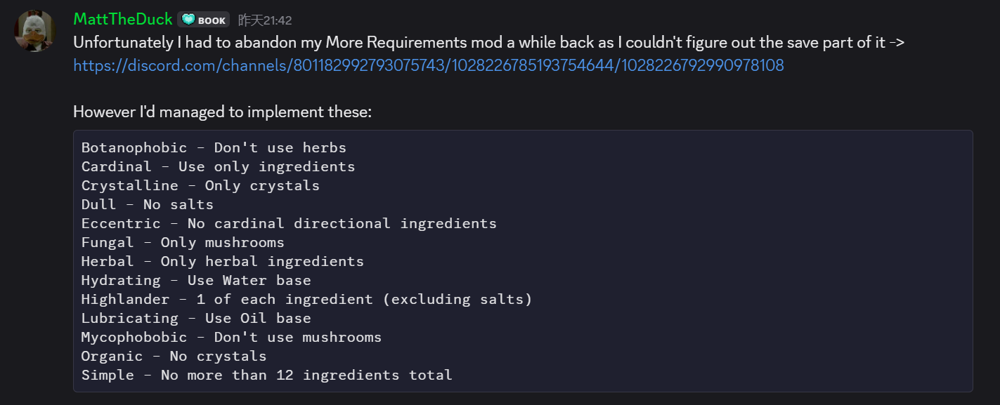

# The source of all this evil mod



# Potion Craft Extra Requirements / Customer Planner

This repository contains two standalone BepInEx plugins for _Potion Craft:
Alchemist Simulator_:

- `PotionCraftExtraRequirements` adds extensible extra customer requirements.
- `PotionCraftCustomerPlanner` adds an in-game regular customer planner window.

The plugins can be used independently. When both are installed, Customer Planner
discovers metadata exposed by Extra Requirements at runtime, so custom
requirements such as ingredient-category restrictions can display their fixed
semantic targets correctly.

## Build

The projects expect the game install path to be provided by the `PotionCraftPath`
MSBuild property. The intended setup is to define it as an environment variable:

```powershell
$env:PotionCraftPath = "(your game install path)"
dotnet build -c Release
```

The build output is written directly to the BepInEx plugin folders:

```text
$(PotionCraftPath)\BepInEx\plugins\PotionCraftExtraRequirements\
$(PotionCraftPath)\BepInEx\plugins\PotionCraftCustomerPlanner\
```

You can also pass the property explicitly for a single build:

```powershell
dotnet build -c Release -p:PotionCraftPath="(your game install path)"
```

## Extra Requirements

Current built-in requirements:

| Requirement                          | Unlock chapter | Price multiplier |
| ------------------------------------ | -------------: | ---------------: |
| No / only herbs                      |              7 |          ×2 / ×3 |
| No / only mushrooms                  |              7 |          ×2 / ×3 |
| No / only crystals                   |              9 |          ×2 / ×3 |
| At most 1 / 2 / 3 of each ingredient |              4 |   ×3 / ×2 / ×1.5 |

Current conflict rules:

- Broad ingredient-category restrictions conflict with each other, Highlander,
  No Salts, and incompatible particular/main ingredient requirements.
- Highlander requirements conflict with each other, broad ingredient-category
  restrictions, native main ingredient requirements, and native max ingredient
  type requirements.

Requirement enabled state, unlock chapter, generation weight, price multiplier,
and popularity reward are configurable in:

```text
BepInEx/config/cn.potioncraft.extra-requirements.cfg
```

## Localization

- Default language: English.
- Currently supported translation: Simplified Chinese (`zh`).
- Other locales fall back to English.

Mod text is exposed through the game localization path. Requirement rendering
still uses the native `GeneratedQuestRequirement` UI, so warning marks, plus
icons, checkmarks, colors, fonts, and rich-text formatting come from the game’s
own assets.

Each requirement provides a small set of mandatory text, optional preference
text, and failure reaction text. The game’s native requirement text pool chooses
the final line; the mod UI does not assemble requirement sentences manually.

## Customer Planner

Customer Planner is split into its own project:

```text
src/PotionCraftCustomerPlanner/PotionCraftCustomerPlanner.csproj
```

Integration notes for other requirement mods are in
[Customer Planner README](src/PotionCraftCustomerPlanner/README.md).

Default toggle key: `F2`.

Runtime settings are stored in:

```text
BepInEx/config/cn.potioncraft.customer-planner.cfg
```

Useful window options include:

- `ToggleShortcut`
- `UIFontSize`
- `PickerFontSize`
- `PickerIconSize`
- `InlineIconSize`
- `InlineIconSpacing`
- `BlockGameInputWhenOpen`
- `NoneButtonColor`
- `MustButtonColor`
- `CanButtonColor`
- `CustomerSelectedColor`

Color values use `#RRGGBB` or `#RRGGBBAA`.

### Planner behavior

The planner modifies the active current customer only. It no longer patches the
not-yet-spawned queue, does not mutate already-spawned waiting NPCs, and does
not write or repair quest/template cooldown state.

When a schedule is added:

- If the current customer can be modified, the planner applies the selected
  customer, quest, and requirement set immediately.
- If there is no current customer, or the current customer cannot be modified,
  the schedule remains pending.
- Each time a new NPC becomes the current customer, the planner tries the
  pending schedule again.

Strict mode limits current-customer rebuilds to normal faction/class customers.
Non-strict mode skips most natural-spawn checks but still avoids merchants and
customers already reserved by another pending schedule.

### Search and selection

The planner supports:

- Manual search. Opening the window does not scan the customer pool repeatedly.
- Exact internal-name search for:
  - `NpcTemplate.name`
  - `Faction.name`
  - `FactionClass.name`
- Text search over customer/faction/class/template identity.
- Quest effect filters:
  - `Needs` effects must all be present.
  - `Excludes` effects remove quests containing any listed effect.
  - Adding an effect to one side automatically removes the same effect from the
    opposite side.
- Chapter and karma preview overrides in non-strict mode.
- A selected target quest for the planned customer.

Customer list rows show compact public information such as customer identity,
gender, karma range, unlock chapter, and matching quest count. Internal names
and full effect summaries remain available in hover tooltips.

### Requirement planning

The planner can assign mandatory (`Must`) and optional (`Can`) extra
requirements to the planned customer.

Target handling follows requirement metadata:

- Requirements with no target show no target row.
- Native wrappers that already contain an `Ingredient` or `PotionBase` show a
  read-only fixed target.
- Native target-capable requirements without a fixed wrapper target can be
  edited with `Ingredient.name` or `PotionBase.name`; the picker button opens a
  bounded dropdown.
- Extra Requirements ingredient-category restrictions expose fixed semantic
  targets such as herbs, mushrooms, and crystals.

The requirement table is grouped by native type and discoverable external tags.
Unknown external requirements are grouped under `Other / external`.

Before scheduling, the planner validates the selected requirement group against
the selected customer and target quest. Combinations blocked by native or
external conflict rules are rejected in the planner UI.

If the planner modifies the active customer while a potion is already on the
scales, it asks the game UI to refresh request text, potion suitability, trade
buttons, and deal value immediately.
